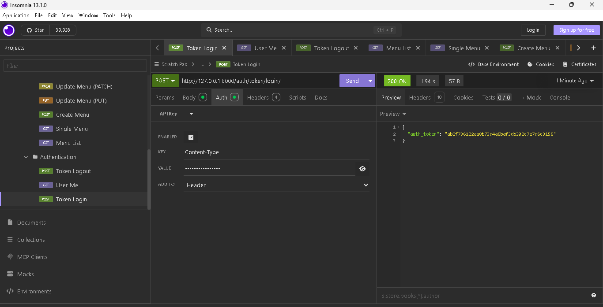

🍋 Little Lemon Restaurant Backend API

## Project Overview

Little Lemon Restaurant Backend API is a Django REST Framework based backend application developed as part of the Coursera Meta Back-End Developer Capstone Project.

The application provides RESTful APIs for restaurant menu management, table booking management, user authentication using Token Authentication, and Django Admin Dashboard for managing restaurant data.

## Technology Stack

- Python 
- Django 
- Django REST Framework
- Djoser Authentication
- MySQL Database
- Token Authentication
- Postman / Insomnia API Testing
- VS Code
---

## Features

### Authentication
- User Login
- Token Authentication
- Get Current User
- Logout
### Menu Management
- List Menu
- Single Menu
- Create Menu
- Update Menu
- Partial Update Menu
- Delete Menu

### Booking Management
- List Booking
- Single Booking
- Create Booking
- Update Booking
- Partial Update Booking
- Delete Booking
---

## Database Configuration

This project uses MySQL database.

Database configuration example:

```python
DATABASES = {
    'default': {
        'ENGINE': 'django.db.backends.mysql',
        'NAME': 'littlelemon',
        'USER': 'your_mysql_username',
        'PASSWORD': 'your_mysql_password',
        'HOST': '127.0.0.1',
        'PORT': '3306',
    }
}
```
## Installation Steps

### 1. Clone Repository
```bash
git clone https://github.com/ranvirignou0516-dot/Little-Lemon--Meta-Back-End-Developer-Capstone-Project
```
### 2. Create Virtual Environment
```bash
python -m venv venv
```
### 3. Activate Virtual Environment

Windows:
```bash
venv\Scripts\activate
```
### 4. Install Dependencies
```bash
pip install -r requirements.txt
```
### 5. Run Database Migration
```bash
python manage.py makemigrations
```
```bash
python manage.py migrate
```
### 6. Create Superuser
```bash
python manage.py createsuperuser
```
### 7. Start Development Server
```bash
python manage.py runserver
```
## Base URL

Local Development:
```text
http://127.0.0.1:8000/
```
## API Endpoints

### Authentication

| Method | Endpoint | Description |
|---|---|---|
| POST | /auth/token/login/ | Login and generate token |
| GET | /auth/users/me/ | Current user details |
| POST | /auth/token/logout/ | Logout |

### Menu APIs

| Method | Endpoint | Description |
|---|---|---|
| GET | /restaurant/menu/ | List menu items |
| GET | /restaurant/menu/{id}/ | Single menu item |
| POST | /restaurant/menu/ | Create menu |
| PUT | /restaurant/menu/{id}/ | Update menu |
| PATCH | /restaurant/menu/{id}/ | Partial update menu item |
| DELETE | /restaurant/menu/{id}/ | Delete menu |

### Booking APIs

| Method | Endpoint | Description |
|---|---|---|
| GET | /restaurant/booking/ | List bookings |
| GET | /restaurant/booking/{id}/ | Single booking |
| POST | /restaurant/booking/ | Create booking |
| PUT | /restaurant/booking/{id}/ | Update booking |
| PATCH | /restaurant/booking/{id}/ | Partial update booking|
| DELETE | /restaurant/booking/{id}/ | Delete booking |

---

## Authentication Header

Protected APIs require token authentication.

```http
Authorization: Token your_token_here
```
## API Testing

The APIs were tested using:

- Insomnia
- Django Admin

Tested operations:

- Authentication
- Menu CRUD 
- Booking CRUD 

## Project Structure

```text
Little-Lemon-Back-End-Developer-Capstone-Project

│
├── littlelemon
│   ├── settings.py
│   ├── urls.py
│
├── restaurant
│   ├── migrations
│   ├── models.py
│   ├── serializers.py
│   ├── views.py
│   ├── urls.py
│
├── screenshots
│   ├── Authentication
│   ├── Menu
│   ├── Booking
│   ├── Admin
│   └── Terminal
│
├── manage.py
├── requirements.txt
└── README.md
```
# Screenshots

## Authentication

### Token Login




### Current User


### Logout


2. Menu Section

## Menu APIs
### Menu List


### Single Menu


### Create Menu


### Update Menu (PUT)

.png)

### Update Menu (PATCH)

.png)

### Delete Menu

.png)


3. Booking Section

## Booking APIs

### Booking List

.png)

### Single Booking

.png)

### Create Booking

.png)

### Update Booking (PUT)

.png)

### Update Booking (PATCH)

.png)

### Delete Booking

.png)


4. Django Admin

## Django Admin

### Admin Dashboard


### Users


### Manager Group


### User Assigned to Manager


### Menu


### Booking


5. Terminal


6. Repository URL

git clone https://github.com/ranvirignou0516-dot/Little-Lemon-Back-End-Developer-Capstone-Project.git

## Author

**Ranvir Kumar**

Coursera Meta Back-End Developer Capstone Project